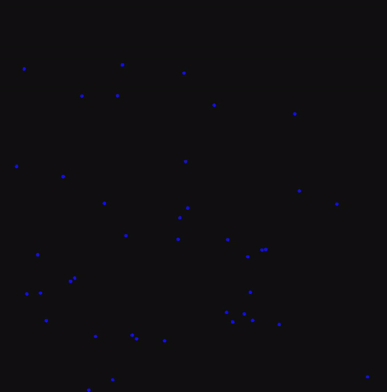

# CUDA N-Body Simulation

A real-time 2D gravitational N-body simulation written in **C++20**, accelerated with **CUDA**, and rendered using **SFML**.

The physics computation runs entirely on the GPU. Rendering is handled on the CPU.

<p align="center">
  
</p>

---

## Overview

Each particle experiences gravitational acceleration from every other particle:
```
aᵢ = G Σⱼ ( (rⱼ - rᵢ) / (|rⱼ - rᵢ|² + ε²)^(3/2) )
```
Integration uses semi-implicit Euler:
```
v += a · dt  
x += v · dt  
```

Current implementation is **O(n²)**.

---

## Performance

Tested on:

- CPU: AMD Ryzen 7 2700X  
- GPU: NVIDIA RTX 2060  

Measured time to perform **10,000 physics steps** (O(n²)).

| Particles | CPU (single-threaded) | GPU(CUDA) |
|-----------|-----------------------|-----------|
| 1000      | 279.13 seconds        | 42.62 seconds |

## Build

Requirements:
- CUDA Toolkit  
- SFML  
- C++20 compiler  
- make  

Build:
```
make
```
